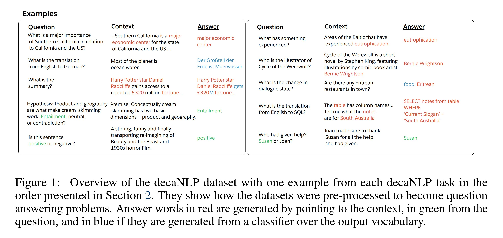

# Fine-tuning Language models to solve Natural Language Understanding tasks

- Dhruv Dhamani (ddhamani@uncc.edu)
- Saloni Gupta (sgupta38@uncc.edu)
- Himanshu Sunil Dhawale (hdhawale@uncc.edu)
- Bhavya Chawla (bchawla@uncc.edu)

## Table of contents

- [Fine-tuning Language models to solve Natural Language Understanding tasks](#fine-tuning-language-models-to-solve-natural-language-understanding-tasks)
  - [Table of contents](#table-of-contents)
  - [Introduction](#introduction)
  - [The Problem](#the-problem)
  - [Literature Review](#literature-review)
  - [Logistics](#logistics)
    - [Timeline](#timeline)
    - [Division of work](#division-of-work)
  - [Miscellaneous Information](#miscellaneous-information)
    - [Questions that we want to answer during the project](#questions-that-we-want-to-answer-during-the-project)
    - [Expectation of what you will be able to learn from the project](#expectation-of-what-you-will-be-able-to-learn-from-the-project)
    - [Is our idea novel?](#is-our-idea-novel)

## Introduction

Omni-Supervised learning was defined as _a special
regime of semi-supervised learning in which the learner exploits all available labeled data plus internet-scale sources
of unlabeled data_ in a paper by Facebook AI Research (FAIR) in the 2017 paper [Data Distillation: Towards Omni-Supervised Learning
](https://arxiv.org/abs/1712.04440).

A fancy name to give to something researchers in NLP have been doing for years. Word embeddings have been sourced from _internet-scale data_, and then applied to several tasks achieving state-of-the-art results.

A paper [The Natural Language Decathlon:
Multitask Learning as Question Answering](https://arxiv.org/abs/1806.08730) has demonstrated how labelled data can be used to train a language model to perform multiple tasks by casting all tasks as question-answers over a context, while another recent paper [Language Models are Unsupervised Multitask Learners](https://d4mucfpksywv.cloudfront.net/better-language-models/language_models_are_unsupervised_multitask_learners.pdf), by researchers at OpenAI, has shown how better quality data, and a more complex transformer based architecture results in a model that can achieve state-of-the-art results without any finetuning whatsoever.



While the researchers at OpenAI made no attempts at finetuning the GPT2 on various tasks - the whole point of the paper was that language models trained with quality data can achieve competitive results on various tasks _without any finetuning_. However, we couldn't help but be _very excited_ about finding out how such a model would perform with finetuning, considering that, to the best of our knowledge, there has never been any language model trained with data of this quality, and scale without the data being bastardized by any harsh pre-processing.

And so that is what we plan on doing. Utilizing the smallest pretrained GPT2 model released by OpenAI, we would be finetuning the model and evaluating it's performance on either the [open, crowd-sourced NLU benchmark by Snips.ai](https://github.com/snipsco/nlu-benchmark/tree/master/2017-06-custom-intent-engines), or the [NLU Evaluation Corpora (Braun et al.)](https://www.sigdial.org/files/workshops/conference18/proceedings/pdf/SIGDIAL22.pdf), whichever proves to be easier to work with.

We'll also be attempting to use data-augmentation in the question-answer format proposed by [McCann et al.](https://arxiv.org/abs/1806.08730), which we hypothesize will result model that generalizes better.

## The Problem

The problem which we refer to as Natural Language Understanding is succinctly described in this [blog post](https://medium.com/snips-ai/benchmarking-natural-language-understanding-systems-google-facebook-microsoft-and-snips-2b8ddcf9fb19.), to quote:

> ### Natural Language Understanding - It's all about filling slots.
>
> The trickiest part in Natural Language Understanding is extracting the attributes of the query the user is making. This problem is called slot-filling.
> Let’s take the following example:
>
> > _“Is it gonna be sunny on **Sunday after lunch**, so we can go to **Coney Island?**”_
>
> A first model will first identify that the user is asking for the weather conditions. The slot filler will then be looking for typical attributes of such queries: a location, a date, etc. In short, the NLU component receives the sentence in natural language: “Is it gonna be sunny on Sunday after lunch, so we can go to Coney Island?”, and returns a structured object that a classic algorithm can act upon:
>
> ```
> {
>  "intent": "GetWeather",
>  "slots":[
>    "datetime": "2017–06–04T14:00:00–05:00",
>    "location": "Coney Island"
>  ]
> }
> ```

## Literature Review

- [The Natural Language Decathlon: Multitask Learning as Question Answering](https://arxiv.org/abs/1806.08730)
- [Language Models are Unsupervised Multitask Learners](https://d4mucfpksywv.cloudfront.net/better-language-models/language_models_are_unsupervised_multitask_learners.pdf)

## Logistics

### Timeline

- March 4  | Project Proposal
- March 15 | Prototype
- March 20 | Training 
- March 25 | Testing and Identify defects
- April 1  | Project Midterm Report
- April 10 | Improve the Model
- April 15 | Training
- April 20 | Testing and Identify Defects
- April 25 | Complete Final Model
- April 30 | Project Poster
- May 6    | Project Final Report

### Division of work


## Miscellaneous Information

### Questions that we want to answer during the project

- How much better does a fine-tuned GPT2 perform vs vanilla GPT2,
- How does the augmentation of the questions and answers posed affect the generalising power of the model.

### Expectation of what you will be able to learn from the project

- Working with neural network frameworks,
- Best practices for training a neural network,
- Answers to the questions posed above.

### Is our idea novel?

In a way yes, in a way no. While we couldn't find evidence of what we propose being done before, it being such a natural extension of earlier works it wouldn't be very ethical to call the work novel.
